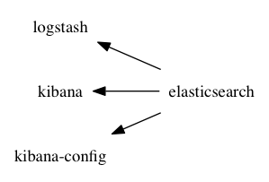
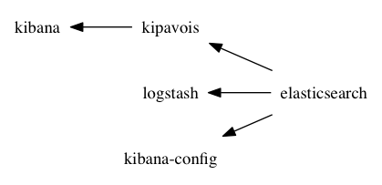

`Docker ELK` provides pillars of a Elasticsearch/Logstash/Kibana
Docker based application.

### How to use it?

1. Fork this repository
1. Add your application configuration
1. Launch it!

#### Logstash

Add your configuration files in the `./logstash` directory. Logstash files
may have the `.conf` extension. You can also add your patterns or any other
files. Just keep in mind that they will be stored in the `/etc/logstash/`
directory.

For instance, if you have the following config files:

```
./logstash/conf.d/50-filter-nginx.conf
./logstash/patterns/google_user_agents
./logstash/patterns/nginx
```

You may reference those patterns in `50-filter-nginx.conf` as follow:

```
filter {
	grok {
	   patterns_dir => "/etc/logstash/patterns"
	   match => { "message" => "%{NGINXACCESS}" }
	}
}
```

A default configuration is provided to listen for items on a syslog-like
server running on port 10514 and push those items to Elasticsearch.

### Kibana configuration

The `./kibana-config` allows you to deploy a Kibana configuration the first
time you application is launched.
To do that, simply put an
[Elasticdump](https://www.npmjs.com/package/elasticdump) json export
of the *.kibana* Elasticsearch index in this directory. Json files must have
the following names:

* `./kibana-config/mapping.json`
* `./kibana-config/data.json`

If files are missing, Kibana will simply start with an empty configuration.
You can then prepare your application by creating your *saved searchs*,
*virtualizations*, and *dashboards*, and then export the configuration to Json
with the following utility:

```shell
$ scripts/export-kibana-config
```

The script leverages [*cogniteev/elk-export-es-index*](https://hub.docker.com/r/cogniteev/elk-export-es-index/) Docker image to export
*.kibana* index in a container under JSON format. Then it uses
`docker cp` commands to retrieve the JSON files back to your workstation.

Note: the Elasticsearch container of your application must be running.

### Available applications

This project provides a couple of use-cases. In both cases the exposed ports
are the following:

* 5601 port is bound to the Kibana front-end application.
* 514 port is bound to the Logstash syslog server.


### Standard application

Docker Compose input file: `standard.yml`



### Kipavois application

KiPavois is an HTTP proxy rewriting Elasticsearch queries made by Kibana 4
to provide data isolation across different users.

Docker Compose input file: `kipavois.yaml`



### Available *Makefile* targets

#### env

Writes to standard output a helpful bourne-shell alias definition that
encapsulates several arguments that need to be passed to Docker Compose.

```shell
$ make env
alias dc-elk="docker-compose -p 'elk' -f 'standard.yml'"
```

You may use the following command to define it in your shell:

```shell
$ eval "$(make env)"
$ type dc-elk
dc-elk is aliased to `docker-compose -p 'elk' -f 'standard.yml''
```

#### pull

Retrieves latest version of all Docker images used by this Docker Compose application.

#### up

Run containers in the background. Equivalent to `docker-compose up -d`

### wait

Wait for the *kibana* container to stop.

### Available *Makefile* options

Here are the environment variables that can be passed to `make` to customize
default behavior.

Name | Default | Description
-----|---------|------------
ELK_APP | elk | Docker containers prefix
ELK_CONFIG | standard.yml | path to docker-compose input file
DOCKER_COMPOSE | docker-compose | path to docker-compose executable

### License

`Docker ELK` is licensed under the Apache License, Version 2.0. See
[LICENSE](LICENSE) file for full license text.
